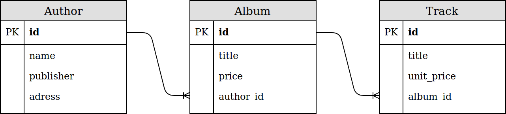

# Python REST stack benchmark
In this benchmark the following databases are tested:
- Sqlite3
- PostgreSQL 11.1
- MongoDB 3.4.19

and the following ORM/ODM with wrappers:
- Django ORM with Django Rest Framework
- Peewee with Flask and Marshmallow
- Flask_SQLAlcehmy with Flask and Marshmallow
- Flask_Mongoengine with Flask and Marshmallow

For each ORM/ODM and DB pair (ORMs and MongoDB) the following things are benchmarked:
- Serialization of 10 objects by pagination

The benchmark results can be replicated with the following

```bash
$ docker-compose -d up
$ pipenv shell
$ python test_server_serialization.py
```

## Benchmarking methodology
For each ORM/ODM and DB pair, the application is dockerized and served thorugh the Gunicorn as a wsgi-server.

Testing script measuring time (an estimate) for processing and serialization of DB content for a server
The time spent processing a request is estimated using cURL through pycURL as `TIME_STARTTRANSFER - TIME_CONNECT` inspired by
- http://blog.cloudflare.com/a-question-of-timing/
- http://stackoverflow.com/questions/17638026/calculating-server-processing-time-with-curl


### Model
The model used is as follows<sup id="a1">[1](#f1)</sup>



## Results

The results are based on 20 measurements for each stack.

|                                               | mean   | min    | max    | std    |
|-----------------------------------------------|--------|--------|--------|--------|
| Flask, Mongoengine (E), Marshmallow, MongoDB  | 1.028  | 1.018  | 1.044  | 0.0068 |
| Flask, Mongoengine (R), Marshmallow, MongoDB  | 1.651  | 1.629  | 1.677  | 0.015  |
| Flask, SQLAlchemy, Marshmallow, PostgreSQL    | 0.6571 | 0.6408 | 0.7192 | 0.017  |
| Flask, SQLAClhemy, Marshmallow, SQLite        | 0.7282 | 0.7134 | 0.7436 | 0.0094 |
| Flask, Peewee, Marshmallow, PostgreSQL        | 0.5534 | 0.5322 | 0.5799 | 0.015  |
| Flask, Peewee, Marshmallow, SQLite            | 0.5873 | 0.5433 | 0.5873 | 0.014  |
| Django/ORM, Django Rest Framework, PostgreSQL | 1.086  | 1.039  | 1.221  | 0.055  |
| Django/ORM, Django Rest Framework, SQLite     | 0.6706 | 0.6528 | 0.7387 | 0.019  |

The minimum time gives an estimate for a lower bound on process time.

## Conclusion


## Footnotes
<b id="f1">1</b> One-to-many relationships are modeled by embedded documents and reference fields respectivly for MongoDB.
 [↩](#a1)